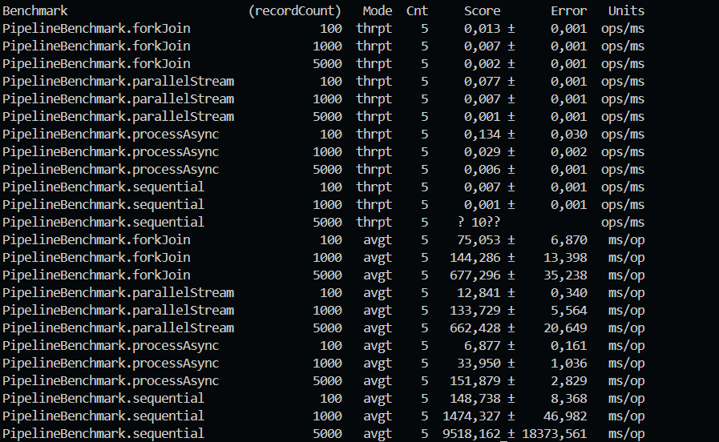

# Algoritmos - Post-Contenido 1 U9

## Descripción del Proyecto

Este proyecto implementa un laboratorio de escalabilidad y rendimiento para la materia Diseño de Algoritmos y Sistemas (Unidad 9). El sistema procesa registros de texto en un pipeline con cuatro etapas:

1. parse
2. enrich
3. transform
4. validate

Se construyen cuatro variantes del mismo flujo para comparar comportamiento:

1. Pipeline secuencial
2. Pipeline con parallelStream
3. Pipeline con CompletableFuture + pool dedicado
4. Pipeline con ForkJoinPool (divide y vencerás)

El objetivo es medir throughput y latencia con JMH, identificar el cuello de botella real y justificar técnicamente la mejor estrategia.

## Objetivo de la Unidad

Medir empíricamente el impacto del paralelismo en un workload mixto (CPU-bound + I/O-bound simulado), comparando resultados reales contra expectativas teóricas.

## Arquitectura del Sistema (Pipeline)

La arquitectura es lineal por etapas y aplica sobre lotes de líneas de entrada.

```text
Entrada (List<String>)
				|
				v
 [parse] ----> [enrich] ----> [transform] ----> [validate] ----> Salida (List<Record>)
	 CPU            I/O sim        CPU pesado         CPU liviano
```

## Tecnologías Utilizadas

| Tecnología    | Versión                  | Uso                                        |
| ------------- | ------------------------ | ------------------------------------------ |
| Java (JDK)    | 17+ (compatible con 21)  | Implementación del pipeline y concurrencia |
| Apache Maven  | 3.8+ (probado en 3.9.12) | Build, tests y empaquetado                 |
| JMH           | 1.37                     | Microbenchmarks (throughput y latencia)    |
| JUnit Jupiter | 5.10.0                   | Pruebas unitarias                          |
| AssertJ       | 3.25.3                   | Asserts expresivos en pruebas              |

## Estructura del Proyecto

```text
algoritmos-castellanos-post1-u9/
|- capturas/
|  |- benchamrk.png
|- src/
|  |- main/
|  |  |- java/
|  |  |  |- co/edu/udes/algoritmos/u9/
|  |  |  |  |- benchmark/
|  |  |  |  |  |- PipelineBenchmark.java
|  |  |  |  |- model/
|  |  |  |  |  |- Record.java
|  |  |  |  |- service/
|  |  |  |  |  |- RecordProcessor.java
|  |  |  |  |- task/
|  |  |  |  |  |- RecordProcessorTask.java
|  |- test/
|  |  |- java/
|  |  |  |- co/edu/udes/algoritmos/u9/service/
|  |  |  |  |- RecordProcessorTest.java
|- .gitignore
|- pom.xml
|- README.md
```

## Prerrequisitos del Entorno

1. Java JDK 17 o superior instalado y configurado en PATH.
2. Maven 3.8 o superior instalado y configurado en PATH.
3. Terminal en la raíz del proyecto.

Comandos de verificación recomendados:

```bash
java -version
mvn -version
```

## Instrucciones de Ejecución (Paso a Paso)

1. Compilar y ejecutar pruebas unitarias:

```bash
mvn test
```

2. Empaquetar proyecto y benchmarks JMH:

```bash
mvn package
```

3. Ejecutar benchmarks:

```bash
java -jar target/benchmarks.jar
```

4. Revisar en consola las métricas de:
1. Throughput (ops/ms)
1. Average Time (ms/op)

## Funcionalidades Principales

1. Procesamiento de registros por etapas (parse, enrich, transform, validate).
2. Comparación de cuatro estrategias de ejecución del mismo pipeline.
3. Medición reproducible de rendimiento con JMH para distintos tamaños de entrada (100, 1000, 5000).
4. Validación de corrección funcional entre implementaciones paralelas y secuencial.
5. Test de regresión de rendimiento para `processAsync`.

## Hipótesis Previa al Benchmark

Antes de medir, la hipótesis fue:

1. `processAsync` sería la más rápida al usar un pool dedicado para la etapa I/O-bound (`enrich`).
2. `parallelStream` mejoraría frente a secuencial, pero con límite por bloqueo en `commonPool`.
3. `forkJoin` sería competitivo en CPU puro, pero sin ventaja clara cuando domina I/O.

## Resultados JMH (Valores Reales)

### Throughput (ops/ms)

| Implementación |   100 |  1000 |                 5000 |
| -------------- | ----: | ----: | --------: |
| sequential     | 0.007 | 0.001 | N/D (estimado: 0.000105) |
| parallelStream | 0.077 | 0.007 |     0.001 |
| processAsync   | 0.134 | 0.029 |     0.006 |
| forkJoin       | 0.013 | 0.007 |     0.002 |

Nota: en la salida de consola, el valor de `sequential` para 5000 en throughput no quedó reportado de forma confiable (`? 10??`). Para mantener consistencia analítica se usa la estimación derivada de `avgt`: $1 / 9518.162 \approx 0.000105$ ops/ms.

### Latencia Promedio (ms/op)

| Implementación |     100 |     1000 |     5000 |
| -------------- | ------: | -------: | -------: |
| sequential     | 148.738 | 1474.327 | 9518.162 |
| parallelStream |  12.841 |  133.729 |  662.428 |
| processAsync   |   6.877 |   33.950 |  151.879 |
| forkJoin       |  75.053 |  144.286 |  677.296 |

## Análisis Comparativo (Teoría vs Medición)

### Cuello de Botella Identificado

La etapa dominante es `enrich`, porque simula I/O con espera (`sleep`) por registro. Esa etapa bloquea hilos y condiciona el rendimiento global.

### Por qué `processAsync` supera a `parallelStream`

`parallelStream` usa `ForkJoinPool.commonPool()` (paralelismo acotado, típicamente cercano a núcleos CPU). Cuando `enrich` bloquea hilos, el pool se satura rápido. En `processAsync`, el pool dedicado amplía la concurrencia para I/O-bound, por eso reduce mucho la latencia total.

### Speedup Empírico (respecto a secuencial)

Se calcula como:

$$
S = \frac{T_{secuencial}}{T_{paralelo}}
$$

Con latencia `avgt`:

1. `parallelStream` (1000): $1474.327 / 133.729 \approx 11.02\times$
2. `processAsync` (1000): $1474.327 / 33.950 \approx 43.43\times$
3. `forkJoin` (1000): $1474.327 / 144.286 \approx 10.22\times$

Speedup adicional por tamaño de entrada para `processAsync`:

1. 100 registros: $148.738 / 6.877 \approx 21.63\times$
2. 5000 registros: $9518.162 / 151.879 \approx 62.67\times$

### Comparación con Ley de Amdahl

Ley de Amdahl:

$$
S(N) = \frac{1}{(1-p) + \frac{p}{N}}
$$

Con 12 procesadores lógicos, incluso con $p=0.95$:

$$
S(12) = \frac{1}{0.05 + 0.95/12} \approx 7.76\times
$$

El speedup observado en `processAsync` supera ese valor porque no es solo paralelismo CPU clásico: se optimiza un tramo I/O-bound aumentando concurrencia efectiva de operaciones bloqueantes, lo cual sale del modelo simplificado de Amdahl puro para CPU.

### Bottleneck Remanente

Después de optimizar, el cuello de botella sigue asociado a:

1. Costo total de `enrich` (espera simulada acumulada).
2. Overhead de coordinación de tareas/futuros cuando crece la entrada.
3. Variabilidad alta en cargas grandes (se evidencia en el error de `sequential` para 5000).

## Complejidad y Justificación Técnica

1. `parse`: $O(m)$ por registro (longitud de cadena).
2. `enrich`: $O(1)$ computacional por registro, pero con latencia bloqueante simulada.
3. `transform`: $O(m)$ por registro.
4. `validate`: $O(1)$ por registro.
5. Pipeline completo: $O(n \cdot m)$, donde $n$ es número de registros y $m$ longitud promedio de `rawData`.

En versiones paralelas, la complejidad asintótica no cambia; mejora el tiempo efectivo por concurrencia, con costo de coordinación adicional.

## Pruebas y Validación

El proyecto incluye pruebas unitarias para:

1. `parse`
2. `enrich`
3. `transform`
4. `validate`
5. Equivalencia de cantidad de resultados entre las 4 implementaciones
6. Regresión de rendimiento (`throughputRegressionTest`)

## Evidencia Visual

Resultado de ejecución de benchmarks JMH:



## Solución de Problemas Frecuentes

1. `java -jar target/benchmarks.jar` falla porque no se ejecutó empaquetado.
2. Solución: ejecutar primero `mvn package`.
3. Los tests o benchmarks salen lentos/inestables por carga del sistema.
4. Solución: cerrar aplicaciones pesadas y repetir corrida para comparar tendencia, no un único valor aislado.
5. Error por versión de Java.
6. Solución: confirmar JDK (no JRE) y versión 17+.

## Conclusiones

1. La implementación con mejor desempeño fue `processAsync` en todos los tamaños medidos.
2. Frente a secuencial, `processAsync` fue aproximadamente 21.63x (100), 43.43x (1000) y 62.67x (5000) más rápido en latencia promedio.
3. Para 1000 registros, `parallelStream` y `forkJoin` mejoran cerca de 11.02x y 10.22x, pero quedan claramente por debajo de `processAsync`.
4. La principal causa es que el workload está dominado por I/O bloqueante en `enrich`; un pool dedicado gestiona mejor esa espera que `commonPool`.
5. La Ley de Amdahl sigue siendo referencia teórica útil, pero en este caso subestima la mejora observada porque no modela completamente la optimización de concurrencia sobre operaciones bloqueantes.
